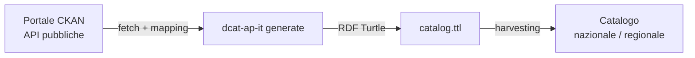

# DCAT-AP IT Generator

> Idea originale di [Daniele Crespi](https://www.linkedin.com/in/danielecrespi/).

Genera file RDF Turtle conformi a [DCAT-AP IT](https://www.dati.gov.it/sites/default/files/2020-02/DCAT-AP_IT.owl) interrogando qualsiasi portale CKAN via API.

## Il problema che risolve

L'approccio tradizionale per produrre metadati DCAT-AP IT da un portale CKAN richiede l'installazione e la manutenzione del plugin [`ckanext-dcatapit`](https://github.com/geosolutions-it/ckanext-dcatapit). Questo plugin:

- non è aggiornato attivamente da anni
- richiede accesso all'infrastruttura del portale
- dipende da una versione specifica di CKAN

**Questo tool funziona in modo completamente indipendente dal plugin e dall'infrastruttura del portale.** Basta che il portale esponga le API CKAN standard (disponibili su qualsiasi installazione CKAN).

## Come funziona

Lo script interroga le API pubbliche del portale CKAN, mappa i campi dei dataset verso le proprietà DCAT-AP IT e produce un file Turtle pronto per essere harvested.



Il file prodotto è pronto per essere harvested da qualsiasi catalogo che supporti DCAT-AP IT — che sia nazionale (es. dati.gov.it) o regionale.

Contiene:
- `dcatapit:Catalog` con i metadati del catalogo
- `dcatapit:Dataset` per ogni dataset pubblicato
- `dcatapit:Distribution` per ogni risorsa

## Installazione

```bash
uv tool install git+https://github.com/aborruso/dcat-ap-it-generator
```

## Uso

```bash
# Crea la configurazione per un portale
dcat-ap-it configure

# Genera il file Turtle
dcat-ap-it generate --config config.yml

# Preview senza scrivere file
dcat-ap-it generate --config config.yml --dry-run

# Genera un file per organizzazione
dcat-ap-it generate --config config.yml --organizations pat,comune-trento
```

## Configurazione

Copia `config.example.yml` e adattalo al tuo portale:

```yaml
portal:
  url: "https://dati.comune.esempio.it"
  query_template: ""          # opzionale: filtro CKAN (es. "organization:nome-org")

catalog:
  uri: "https://dati.comune.esempio.it/catalog"
  title: "Catalogo Open Data"
  publisher_name: "Comune di Esempio"
  publisher_identifier: "c_xxxxx"   # codice IPA
  language: "ITA"

output:
  path: "output/catalog.ttl"
```

## Uso in cron

```bash
# Ogni domenica alle 3:00
0 3 * * 0 dcat-ap-it generate --config /path/to/config.yml
```

## Portali testati

| Portale | Dataset | Distribuzioni |
|---------|---------|---------------|
| dati.trentino.it | 1329 | 6070 |
| dati.comune.messina.it | 105 | 526 |
| dati.regione.sicilia.it | 191 | 2351 |
