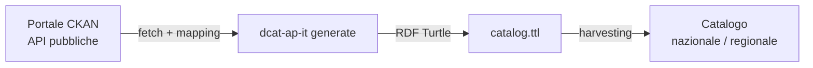

# DCAT-AP IT Generator

> Idea originale di [Daniele Crespi](https://www.linkedin.com/in/danielecrespi/).

> **Nota:** prodotto ancora in fase di test. L'output potrebbe non essere completamente conforme a DCAT-AP IT.

Genera file RDF Turtle conformi a [DCAT-AP IT](https://www.dati.gov.it/sites/default/files/2020-02/DCAT-AP_IT.owl) interrogando qualsiasi portale CKAN via API.

## Il problema che risolve

L'approccio tradizionale per produrre metadati DCAT-AP IT da un portale CKAN richiede l'installazione e la manutenzione del plugin [`ckanext-dcatapit`](https://github.com/geosolutions-it/ckanext-dcatapit). Questo plugin:

- non è aggiornato attivamente da anni
- richiede accesso all'infrastruttura del portale
- dipende da una versione specifica di CKAN

**Questo tool funziona in modo completamente indipendente dal plugin e dall'infrastruttura del portale.** Basta che il portale esponga le API CKAN standard (disponibili su qualsiasi installazione CKAN).

## Come funziona

Lo script interroga le API pubbliche del portale CKAN, mappa i campi dei dataset verso le proprietà DCAT-AP IT e produce un file Turtle pronto per essere harvested.



Il file prodotto è pronto per essere harvested da qualsiasi catalogo che supporti DCAT-AP IT — che sia nazionale (es. dati.gov.it) o regionale.

Contiene:
- `dcatapit:Catalog` con i metadati del catalogo
- `dcatapit:Dataset` per ogni dataset pubblicato
- `dcatapit:Distribution` per ogni risorsa

## Installazione

```bash
uv tool install git+https://github.com/ondata/dcat-ap-it-generator
```

Il pacchetto include le **154 regole SPARQL DCAT-AP IT** (da [daf-semantic-validator](https://github.com/italia/daf-semantic-validator)) usate dal comando `validate`. Non è necessario scaricarle separatamente.

## Vuoi testarlo subito?

Nella cartella `examples/` trovi una configurazione già pronta per il portale open data del **Comune di Messina**.

```bash
# 1. Clona il repository
git clone https://github.com/ondata/dcat-ap-it-generator
cd dcat-ap-it-generator

# 2. Installa il tool
uv tool install .

# 3. Anteprima senza scrivere file
dcat-ap-it generate --config examples/config-messina.yml --dry-run

# 4. Genera il file Turtle
dcat-ap-it generate --config examples/config-messina.yml
# → output/messina.ttl
```

## Uso

```bash
# Genera il file Turtle
dcat-ap-it generate --config config.yml

# Anteprima senza scrivere file
dcat-ap-it generate --config config.yml --dry-run

# Genera un file per organizzazione
dcat-ap-it generate --config config.yml --organizations org1,org2

# Wizard interattivo per creare una nuova configurazione
dcat-ap-it configure

# Valida un file TTL contro le 154 regole DCAT-AP IT
dcat-ap-it validate output/catalog.ttl

# Solo errori (esclude warning)
dcat-ap-it validate output/catalog.ttl --errors-only
```

## Configurazione

Copia un file da `examples/` e adattalo al tuo portale:

```yaml
portal:
  url: "https://dati.comune.esempio.it"   # URL base portale CKAN
  api_key: ""                              # opzionale, per portali privati
  rows_per_page: 100                       # dataset per richiesta paginata (default: 100)
  max_datasets: 0                          # limite totale dataset; 0 = nessun limite (default: 0)
  chunk_size: 0                            # se > 0, genera N file TTL separati (es. 500 → catalog_001.ttl, _002.ttl…)
  query_template: ""                       # opzionale: filtro CKAN fq (es. "organization:nome-org")

catalog:
  uri: "https://dati.comune.esempio.it/catalog"
  title: "Catalogo Open Data"
  description: ""                          # opzionale
  issued: ""                               # opzionale, formato ISO 8601
  publisher_name: "Comune di Esempio"
  publisher_identifier: "c_xxxxx"         # codice IPA — cerca su https://indicepa.gov.it
  language: "ITA"                          # codice ISO 639-3
  homepage: ""                             # opzionale
  spatial: ""                              # opzionale, URI GeoNames (es. https://www.geonames.org/2524170)

output:
  path: "output/catalog.ttl"
```

## Uso in cron

```bash
# Ogni domenica alle 3:00
0 3 * * 0 dcat-ap-it generate --config /path/to/config.yml
```
